# Using CDK to set up a cross-account/region and centralised Opensearch architecture

This is a CDK project that deploys a cross-account/region centralised Opensearch log pipeline. When you deploy this CDK, it will be deployed in the following order

1. OpenSearchStack: includes opensearch cluster in VPC with appropriate security groups and bastion window instance for public access
2. NginxForOpenSearchStack and S3Stack:
   - NginxForOpenSearchStack: includes ALB, nginx auto-scaling group and appropriate security groups.
   - S3Stack: contains two classes
     - LogBucket Class: contains four S3 buckets in SRE region (Frankfurt), SQS for S3 event triggers, firehose role to access S3, KMS key for S3 encryption and appropriate IAM roles. Four S3 buckets are
       - firehose target bucket (application log bucket)
       - firehose destination backup bucket (used to store failed records for lambda processing)
       - Data ingestion failed bucket (for any failed records from the data ingestion pipeline)
       - S3 access log bucket (for security governance in Samsung)
     - DataIngestion Class: includes opensearch data ingestion pipeline and corresponding configuration file

> Warning: `nginxProps` has optional values called `elbDomain`. You must set the `elbDomain` value to a domain name registered in your domain server to access opensearch with an https certificate. **Otherwise, you should be able to access opensearch through the alb domain provided by AWS, where you will not be able to securely connect to the opensearch site.**

3. PipelineStack: contains cloudwatch log destination, target firehose delivery stream, transformer lambda and appropriate IAM roles.

# Steps to deploy

- Clone the repository and move terminal into it.
- Go to the 'Infra' directory.
- Run `npm install`.
- Configure your aws cli credentials file with SRE profiles.
- Run `npx cdk deploy --profile {YOUR-PROFILE-NAME} -c sre=dev -c target={TARGET-ACCOUNT-PROFILE-NAME}`.
  - Update the values in the braces.
  - Context sre={profile} will find config-{profile}.properties and extract contexts from that file.
  - For example, to deploy the stg2 pipeline in the SRE dev account, you should run
    - `npx cdk deploy --profile {YOUR-PROFILE-NAME} -c sre=dev -c target=stg2`
  - Another example, to deploy the dev2 pipeline in the SRE prd account, you should run
    - `npx cdk deploy --profile {YOUR-PROFILE-NAME} -c sre=prd -c target=dev2`

### Mapping data prepper role to opensearch role

- After deploying this CDK you will get `sts-role-${targetProfile}-${targetRegion}` CfnOutput.
  - Make a note of this output parameter to use in the next step
  - Below is the example of CfnOutput that should be noted
  - 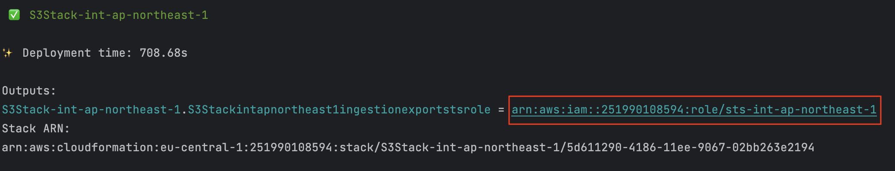
- Go to the Openesearch dashboard (via the alb domain or your custom domain).
- Navigate to Security
- 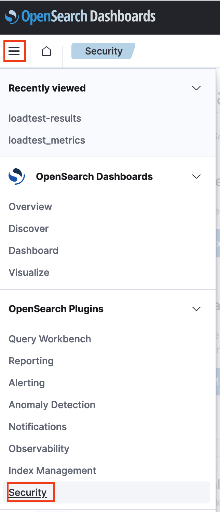.
- Navigate to Roles
- 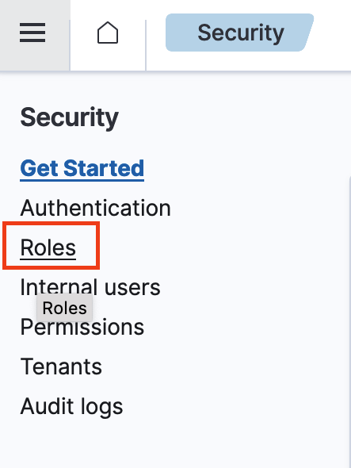
- Search for 'all_access'
- 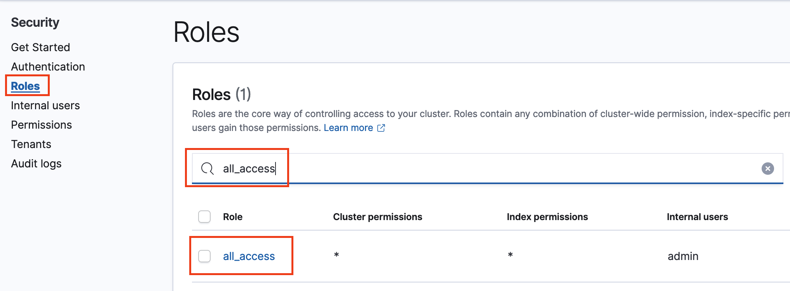
- Go to 'Mapped Users' and click 'Manage Mapping
- 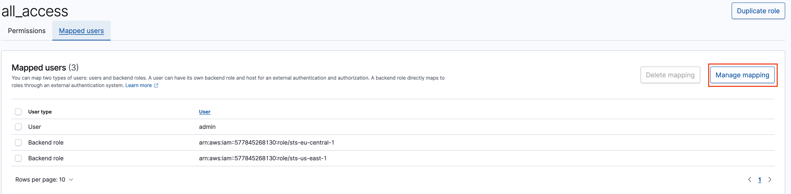
- Paste your copied `sts-role-${targetProfile}-${targetRegion}` value, which is the Data Prepper sts role arn and click 'Map'.
- 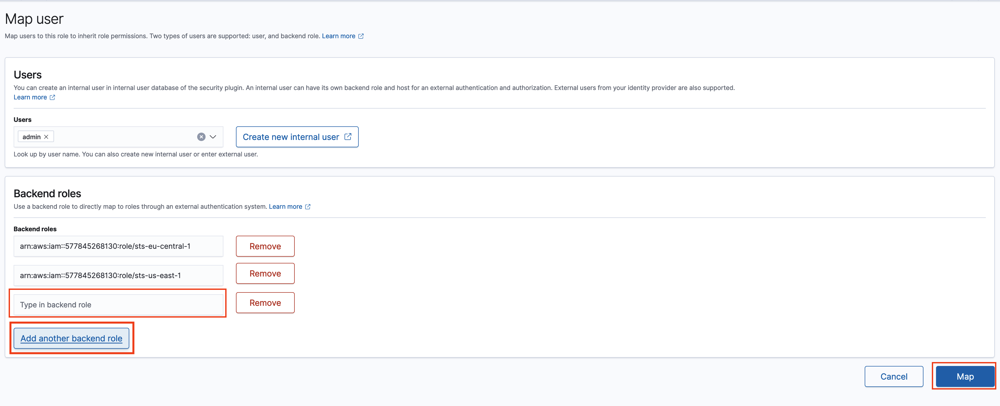

### Manual capacity change

Due to cdk limitation, [data ingestion pipeline min OCU](lib/s3/data-ingestion.ts#L60) only accepts 1-4 at the moment. **Please update this value to 10 via the console.**

1. Go to opensearch console > Pipelines under Ingestion > Click the pipeline > Edit capacity under Actions.

- 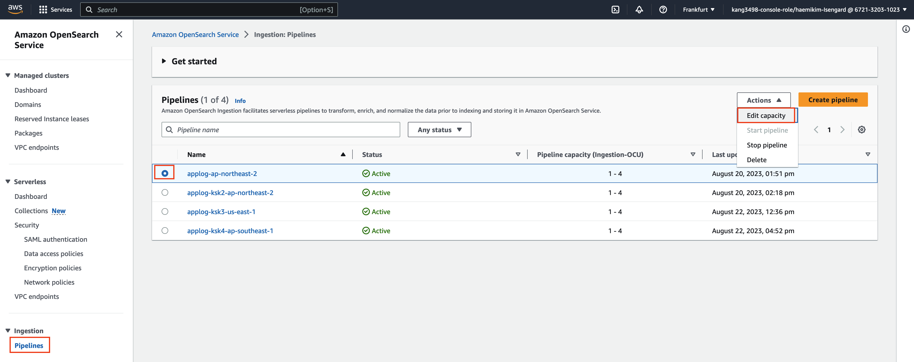

2. Change the min capacity to 10, max capacity to 48 and click Save.

- 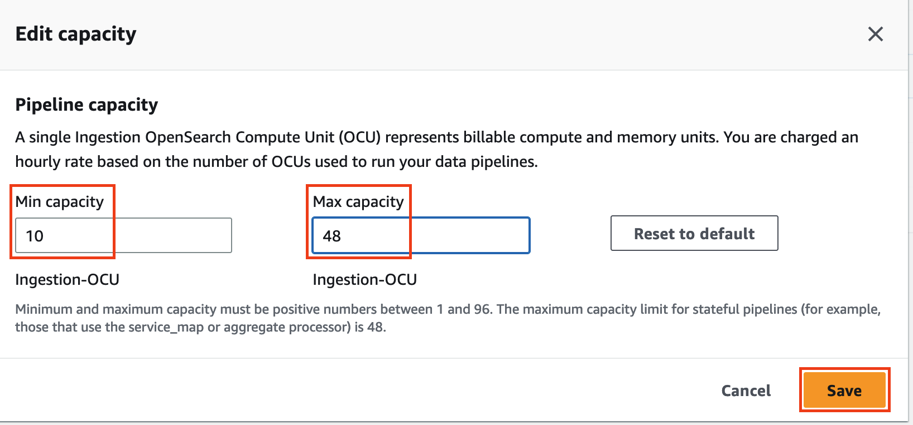

3. Wait until the status becomes 'Updating' to 'Active'

- 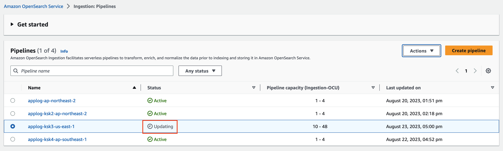
- 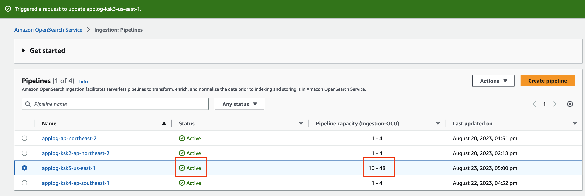

# Values to look out for in your settings

1. [SQS visibility timeout value](lib/s3/data-ingestion.ts#L60): Through load testing, the AWS team found that the default SQS visibility timeout value set in the data ingestion pipeline configuration (30s) was causing log duplication even at low loads due to multiple data prepper nodes and insufficient timeout values before processing was complete. To avoid [this issue](https://github.com/opensearch-project/data-prepper/issues/2484), we have set the [SQS visibility timeout value](lib/s3/data-ingestion.ts#L33) high enough (currently 300s), but you can set this higher for your actual production environment.

2. [Data ingestion pipeline min OCU](lib/s3/data-ingestion.ts#L60): Through load testing, the AWS team found that the OCU scaling delay in the data ingestion pipeline was causing huge log lags from applications sending logs to the data ingestion pipeline and log duplication. To avoid this problem, we recommend setting [data ingestion pipeline min OCU](lib/s3/data-ingestion.ts#L60) to at least 10. However, due to cdk limitations, the value only accepts 1-4 at the moment. **Please update this value to 10 via the console.** You can set this higher for your actual production environment. Please be careful when setting this value as it is cost related.

> Warning: Due to cdk limitation, [data ingestion pipeline min OCU](lib/s3/data-ingestion.ts#L60) only accepts 1-4 at the moment. **Please update this value to 10 via the console.**

# Things to remove in production

## 1. Remove the Firehose Lambda Transformer to improve performance.

- The Firehose Lambda Transformer parses log records to

  - convert all unstructured logs from applications that have not enabled the logging SDK into JSON format. [link](lambda/firehoseTransformer.js#L87)
  - Append a new line '\n' at the end of each record so that Firehose puts each Json object record line by line into the S3 object file. [link](lambda/firehoseTransformer.js#L86)
  - Append `firehose_arrival_time` to each log record to calculate ingest delay in opensearch. [link](lambda/firehoseTransformer.js#L85)

- Once you've migrated to the logging SDK, you won't need the lambda transformer anymore. However, due to the Firehose limitation, you should append a new line '\n' at the end of each log record. Having a lambda transformer for this simple processing will cause additional log delays. We recommend instead that you use the logging SDK to add a new line '\n' at the end of each log record.
  Another thing to note is that lambda logs in cloudwatch include lambda platform logs like 'INIT_START Runtime Version: nodejs:18.v7 Runtime Version ARN: arn:aws:lambda:us-east-1::runtime:26e9402591d9c467cdcc7355f843d61968f36ecb6e9ef5ab253cc21163343275' and this log is not in JSON format either. If you want to send these logs to opensearch, then a lambda transformer is needed

## 2. Remove things related to running painless script in Opensearch to calculate log ingest delay

We do not recommend using the painless script field in Opensearch in production environments as it can reduce search performance.

- You should remove
  - [the part appending 'firehose_arrival_time'](lambda/firehoseTransformer.js#L85) to each log record in the firehose lambda transformer.
  - [the part appending '@prepper_arrived'](lib/s3/config/pipelinesTemplate.yaml#L21) to each log record in Opensearch Data Ingestion

# Things to improve

Due to the firehose limitation, you should append a new line '\n' at the end of each log record. Using a lambda transformer for this simple processing will cause additional log delays. We recommend using the logging SDK to add a new line '\n' at the end of each log record instead.

# Centralised protocol architecture

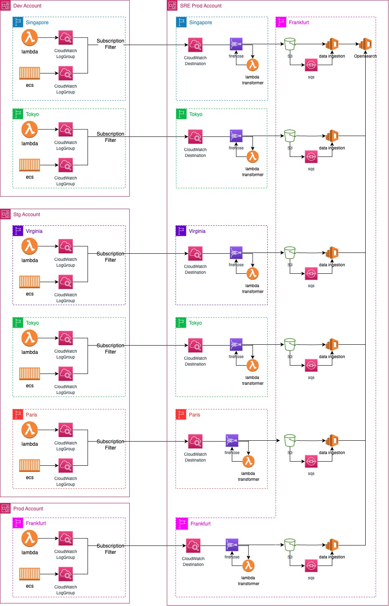.

This architecture centralises all logs from different accounts and regions into a single OpenSearch cluster. You can search for logs in OpenSearch for the environment you are working in by selecting the environment prefix (e.g. dev2, prd, etc). You no longer need to switch between different accounts and regions in the AWS console.

Now let's take a look at what happens in each part.

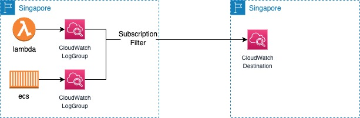.

Each platform your application runs on (lambda and ecs) sends logs to Cloudwatch log groups. Each log group has a subscription filter to send all logs to a cloudwatch destination in the same region in the target account.

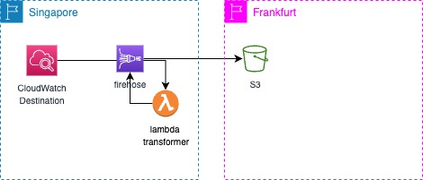.

Cloudwatch destination forwards logs to target firehose in same region. Lambda transformer parses the log and sends it back to the firehose.
Lambda Transformer will

1. Gunzip the data
2. Parse the json
3. Set the result to ProcessingFailed for each record whose messageType is not DATA_MESSAGE, thereby redirecting it to the
   processing error output. Such records will not contain any log events. You can modify the code to set the result to
   instead to get rid of these records completely.
4. For records whose messageType is DATA_MESSAGE, extract the individual log events from the logEvents field and pass them to the transformLogEvent method.
   each one to the transformLogEvent method. You can modify the transformLogEvent method to perform custom transformations on the
   transformations on the log events.
5. Concatenate the result from (4) and set the result as the data of the record returned to Firehose. Note that
   this step does not add any delimiters. Separators should be added by the logic within the transformLogEvent
   method.
6. Any single record that exceeds 6,000,000 bytes in size after decompression, processing and base64 encoding is marked as Dropped.
   and the original record is split into two and re-imported into Firehose or Kinesis. The re-inserted
   should be about half the size of the original, and should fit within the size limit the second time around.
   round.
7. If the total data size (i.e. the sum over multiple records) after decompression, processing and base64 encoding exceeds
   exceeds 6,000,000 bytes, any additional records will be reinserted into Firehose or Kinesis.
8. The retry count for intermittent failures during re-ingestion is set to 20 attempts. If you wish to reduce the number of
   of times for intermittent failures, you can reduce this value.

Kinesis Data Firehose receives records from lambda and places them on S3 in target Frankfurt region. (Firehose supports cross-regional S3 bucket destinations.) Firehose buffers incoming data before delivering it to Amazon S3 with buffer size (minimum size of 1M) or buffer interval (minimum interval of 60 seconds), where the condition that is met first triggers data delivery to Amazon S3. The buffer size and interval are set to minimum values to minimise log delivery latency.

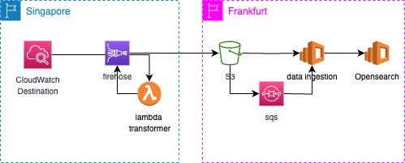.

When logs are delivered to S3 and an S3 object is created, S3 triggers an S3 creation event to SQS. The [data ingestion pipeline] (https://docs.aws.amazon.com/opensearch-service/latest/developerguide/ingestion.html) (managed data prepper service provided by AWS) will ingest data from S3, process the data and sink it to opensearch.

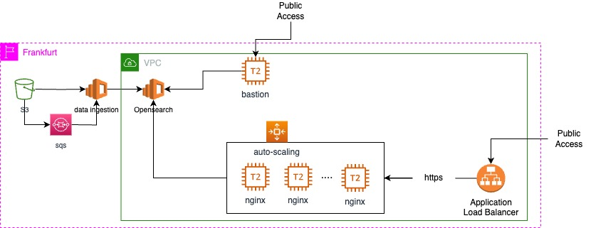.

As opensearch resides in the VPC, public access to opensearch is restricted. There are two types of access, one through the Bastion window server, the other through a combination of application + nginx.

You no longer need to switch between different accounts and regions in the AWS console. You can simply select your environment containing the logs by selecting opensearch indexes.

You can easily search and filter logs in a single interface. In the example below, you can filter logs for a bootstrap business transaction by searching the 'traceId' field.

# Welcome to your CDK TypeScript Construct Library projec

You should explore the contents of this project. It demonstrates a CDK Construct Library that includes a construct (`Infra`)
which contains an Amazon SQS queue that is subscribed to an Amazon SNS topic.

The construct defines an interface (`InfraProps`) to configure the visibility timeout of the queue.

## Useful commands

- `npm run build` compile typescript to js
- `npm run watch` watch for changes and compile
- `npm run test` perform the jest unit tests
